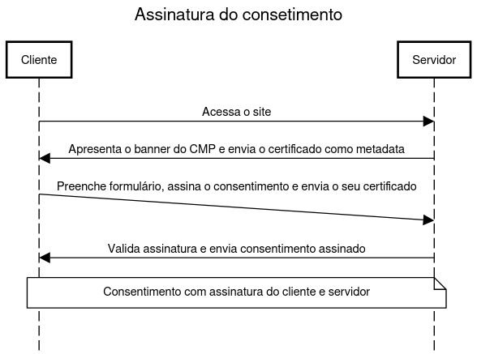

# Client Consent Handshake

### Extensão para integrar a troca de consentimento.

Este diagrama ilustra o processo de assinatura do consentimento entre o cliente e o servidor. Ao aceder ao site, o cliente recebe do servidor um banner CMP juntamente com um certificado como metadata. Em seguida, o cliente preenche um formulário, assina o consentimento juntamente com o seu certificado e envia essa informação de volta ao servidor. O servidor valida a assinatura e devolve o consentimento assinado. O processo garante que o consentimento é autenticado por ambas as partes.

## Assinatura Digital com RSA

Para garantir a autenticidade do consentimento, é utilizado o algoritmo RSA de assinatura. Como o consentimento está representado em formato JSON, será utilizado o padrão **JWS (JSON Web Signature)** para encapsular os dados e a assinatura de forma estruturada.

### Assinatura (lado do cliente):

- Calcula-se o hash da mensagem: `h = hash(msg)`
- O hash é cifrado com a chave privada do cliente proveniente do certificado: `s = h^d mod n`, produzindo a assinatura `s`
- O consentimento, a assinatura e os metadados são então estruturados num objeto **JWS**

### Verificação (lado do servidor):

- Calcula-se com a mesma função de hash a mensagem recebida: `h = hash(msg)`
- A assinatura `s` é desencriptada com a chave pública do cliente: `h' = s^e mod n`
- Compara-se `h` com `h'`. Se forem iguais, a assinatura é válida

A utilização de JWS garante que o consentimento assinado em JSON é facilmente transportável, verificável e validável de forma padronizada.

A assinatura RSA assegura que o conteúdo não foi alterado e que provém de quem afirma ser, ou seja, protege contra alteração e falsificação.
